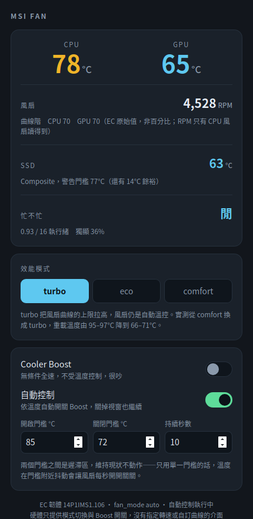

# MSI Fan

MSI 筆電在 Ubuntu 上的風扇狀態檢視與控制。Tauri 2 + Rust。



## 這支能做什麼、不能做什麼

先講清楚邊界，免得你期待落空：

| 功能 | 可行 |
|---|---|
| 即時看 CPU／GPU 溫度、風扇 RPM 與百分比 | 可以 |
| 切換效能模式（turbo／comfort／eco） | 可以 |
| Cooler Boost 開關 | 可以 |
| 依溫度自動開關 Boost（帶遲滯，背景常駐） | 可以 |
| **拖滑桿指定轉速，例如 4200 RPM** | **不行** |
| **自訂溫度-轉速曲線** | **不行** |

後兩項不是還沒做，是**硬體沒開放**。`msi-ec` 在這台機型（Cyborg 14 A13VF / EC `14P1IMS1.106`）的設定檔只暴露三個開關，沒有曲線控制點。`available_fan_modes` 裡雖然有 `advanced`，但對應的曲線欄位沒有被暴露出來。

所以這裡的「自動控制」是用 Boost 這個開關做的，不是連續調速。

## 為什麼需要這支

風扇本來就有自動溫控，那是 EC 韌體在管的，跟作業系統無關。問題出在 EC 裡的效能設定檔——出廠停在 `comfort`，把風扇曲線的上限壓在最高轉速的 57%，所以溫度再高也只轉到 3600 RPM。

改那個設定檔的官方工具是 MSI Center，只有 Windows 版；核心內建的 `msi_wmi_platform` 又只能讀不能寫。這支就是補上那個缺口。

實測差異（同一台、同樣負載）：

| | comfort | turbo |
|---|---|---|
| 風扇 | 3555–3609 RPM | 6315 RPM |
| CPU | 95–97°C | 66–71°C |
| GPU | 67–68°C | 63–65°C |

## 安裝

### 一、msi-ec 核心模組

這支程式只是介面，實際控制靠 [msi-ec](https://github.com/BeardOverflow/msi-ec)。

```bash
sudo apt-get install -y dkms build-essential
git clone --depth 1 https://github.com/BeardOverflow/msi-ec.git
cd msi-ec && sudo make dkms-install && sudo modprobe msi-ec
ls /sys/devices/platform/msi-ec/          # 要看到 cooler_boost、fan_mode、shift_mode
```

**先確認你的機型有支援。** msi-ec 是靠 EC 韌體版本字串比對的白名單，不是前綴比對——版本差一號就不會載入。查自己的版本：

```bash
sudo modprobe ec_sys
sudo dd if=/sys/kernel/debug/ec/ec0/io bs=1 skip=160 count=16 2>/dev/null | tr -d '\0'; echo
sudo rmmod ec_sys
```

拿到的字串（例如 `14P1IMS1.106`）到 msi-ec 的 `msi-ec.c` 裡搜尋，有才裝。

### 二、控制項的權限

`shift_mode` 等三個檔案預設 root-only。開一個群組給它們，程式就不必用 root 跑：

```bash
sudo groupadd -f msiec
sudo usermod -aG msiec $USER
sudo cp dist/msi-ec-perms.service /etc/systemd/system/
sudo systemctl daemon-reload && sudo systemctl enable --now msi-ec-perms
```

**加入群組之後要重新登入才會生效。** 沒重新登入的話，檔案看起來是可寫的，但你的 process 其實不帶那個群組——程式會偵測到並在畫面上提示。

> 原本用 udev 規則做，但 `RUN+=` 對 sysfs 屬性不穩定，改用 systemd 一次性服務比較可靠也好除錯。

### 三、程式本身

```bash
npm install
npm run build          # 或 cd src-tauri && cargo build --release
./install.sh
```

背景自動控制（關掉視窗也繼續管）：

```bash
systemctl --user enable --now msi-fan-auto
```

## 自動控制的設計

只有開關沒有連續調速，所以規則是「超過上門檻持續 N 秒就開 Boost，掉到下門檻以下持續 N 秒才關」。

兩個門檻之間是**遲滯區**，維持現狀不動作。這個不能省——只用單一門檻的話，溫度在門檻附近抖動會讓風扇每秒開開關關，比不做還糟。所以 `off_below` 必須低於 `on_above`，寫反了會被擋下來。

設定檔在 `~/.config/msi-fan/config.json`，守護行程每秒重讀，改完不必重啟服務。

預設值 `on_above=85 / off_below=72 / hold_secs=10`。門檻的由來是上面那張實測表：
turbo 常駐就把重載溫度壓在 66–71°C，85°C 已經算異常，才值得叫 Boost 出來。

### 效能模式與自動 Boost 是分開的

守護行程啟動時會把 `shift_mode` 套成設定檔裡的值（預設 `turbo`），**這件事跟 `enabled` 無關**——「開機就要 turbo」不該被迫連自動 Boost 一起開。

在 GUI 裡按效能模式的按鈕，除了立刻生效之外也會寫進設定檔，所以「上次選的模式」就是下次開機要套用的模式。

> EC 會不會自己保留 `shift_mode` 沒查證過，記在自己這邊才不必賭。

## 已知限制

- 只在 **Cyborg 14 A13VF（EC `14P1IMS1.106`）** 上實測過。其他機型只要 msi-ec 支援、且設定檔同樣暴露那三個控制項，理論上可用，但沒驗過。
- `shift_mode` 會不會跨重開機保留還沒確認。若重開後跑 `cat /sys/devices/platform/msi-ec/shift_mode` 發現變回 `comfort`，就啟用背景服務，它會在啟動時套用設定。
- 驅動的 hwmon 暴露 fan1–fan4，但只有 fan1 讀得到值。那是通用欄位，不代表機器有四顆風扇。

## 開發

```bash
npm run dev                    # 熱重載
cd src-tauri && cargo test     # 後端測試：讀狀態、擋不合法的值、擋寫反的門檻
```

前端是單一 `ui/index.html`，沒有打包器——這支只有一個畫面，加 bundler 只是多一層要維護的東西。

## 授權

MIT，林亞澤。
